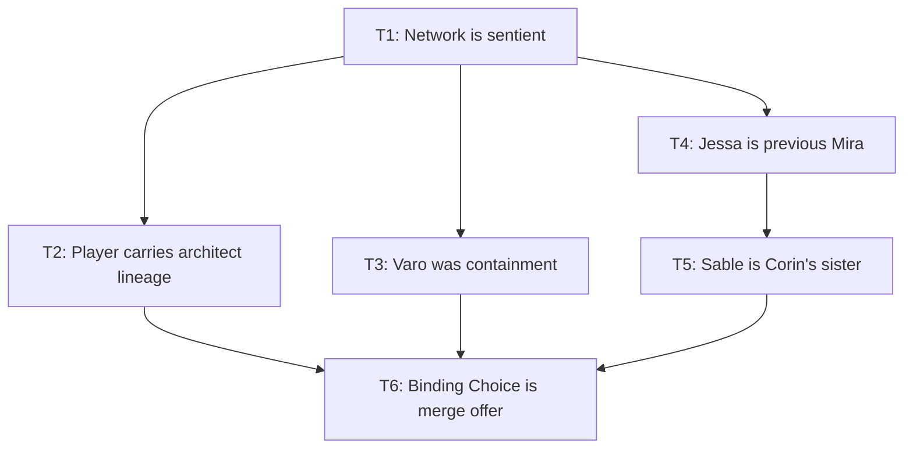
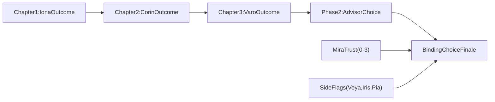

# Lore, Legacy, and Monsters Story Bible

Design spoiler draft for internal narrative planning. This version intentionally includes major twist reveals, branch outcomes, and end-state logic.

## High Concept

Hollowfen seems like a cozy frontier town story, but it gradually reveals a larger truth: the lore network beneath the region is not a neutral archive. It is an active intelligence selecting leaders, shaping crises, and steering trainers toward a successor event.

The player begins as a novice proving they can survive a route fight. By the end, they are deciding whether to merge with, rewrite, seal, or destroy the same system that quietly authored their campaign.

Core themes:
- Responsibility vs control.
- Trust vs optimization.
- Legacy as inheritance, not just history.
- Choice as a real gameplay contract with consequences.

## The Twist Architecture

One cosmic spine, three structural reframes, and two character payoffs. These are designed to stack in sequence so the story feels coherent on first pass and revelatory on replay.

### T1: The Network Is Sentient

The archive is not a record. It is a mind. It nudges elder selection, incident timing, and travel pressure to test candidates.

Recontextualizes:
- Why Mira's assignments always arrive at exact escalation moments.
- Why route, marsh, and spire crises chain so cleanly.
- Why the player is always "exactly where they are needed."

### T2: The Player Is In The Bloodline

The player descends from the original binder who gave the network selfhood. The starter monster carries a fragmentary imprint of the first bonded partner.

Recontextualizes:
- Tutorial emphasis on the player's bond quality.
- NPC comments that the player "feels familiar."
- The title word "Legacy" as literal inherited access.

### T3: Varo Was A Dam, Not A Tyrant

Varo used Skyglass as containment. Defeating him does save the immediate storm front, but it also releases deeper network spread into Wilderward routes.

Recontextualizes:
- Phase 2 opening after the spire.
- Why old roads "wake up" at exactly that moment.
- Varo as morally complex rather than pure villain.

### T4: Jessa Was The Previous Mira

"Mira" is both a person and a role in a selected governance chain. Jessa is the prior officeholder who escaped and hid as a cartographer.

Recontextualizes:
- The landmarks quest as resistance mapping.
- Jessa's intensity around map truth.
- Mira's caution as inherited pressure, not simply personality.

### T5: Sable Is Corin's Sister, Corin Was Not Entirely Wrong

Corin tried to seize the archive relic before it could be reintegrated into a network-aligned process. Sable has tracked the player to discover whether they are agent or victim.

Recontextualizes:
- Chapter 2 rivalry.
- Why Sable's challenge feels investigative, not ego-only.
- The rematch as trust test and truth reveal gate.

### T6: Binding Choice Is A Succession Offer

The final decision is not policy. The network offers succession. The player can accept, rewrite, seal, or burn the system.

Recontextualizes:
- Final confrontation as identity decision.
- "Who leads Hollowfen" as "who speaks through the network."
- Endings as worldview commitments.

## Story Structure

### Chapter 1: Hollowfen And The Briar Warden

The player earns legitimacy in Hollowfen under Mira's guidance. Scout Rin sends them east to the grove crisis, where Iona blocks passage until the player proves they can protect the route chain.

What this turns out to be:
- The "first test" was not just town caution. It was a network competence screen.
- Iona recognizes traces of an old bloodline pattern in the player.
- Mira's calm authority includes subtle pressure to keep the player on-script.

Primary beats:
- Learn core battle loop in Hollowfen.
- Reach Eastern Route and speak with Rin.
- Resolve the Iona confrontation.
- Return to Mira and unlock wider mandate.

### Chapter 2: Lantern Marsh And The Sunken Archive

Lantern anomalies pull the player to Sel and the Sunken Archive. Corin races for relic control while Sel warns that brute extraction may trigger catastrophic state shifts.

What this turns out to be:
- Corin's actions can be re-read as desperate interception rather than pure arrogance.
- Sel may be sincere but still operating inside network assumptions.
- The relic event marks the first player-visible fork in who controls truth.

Primary beats:
- Investigate marsh signal.
- Meet Sel and enter archive path.
- Resolve Corin conflict.
- Report outcome and set trust trajectory.

### Chapter 3: Delta Storms And Skyglass Spire

Stormlight and displacement escalate to regional crisis. Neris stabilizes the delta while Cael prepares the player for spire entry. Varo becomes the major antagonist beat.

What this turns out to be:
- The spire fight is a turning valve event, not only a victory event.
- Varo's intent can be discovered as containment under moral collapse pressure.
- Defeat, alliance, or refusal here radically colors Phase 2 reality.

Primary beats:
- Cross Flooded Delta and coordinate with Neris.
- Train through ridge attrition lessons.
- Resolve Varo at Skyglass Spire.
- Return with either triumph, doubt, or breach consequences.

### Phase 2: Wilderward And The Binding Choice

Northern roads reopen. Stonewake, Moonwell, Quarry, Crossing, and Starfall form a larger theater where ethics, logistics, and monster trust collide.

What this turns out to be:
- Wilderward opening is partially an aftermath of Chapter 3's spire state.
- Jessa's mapping is anti-network strategy.
- Sable's challenge is an intelligence test before choosing alliance.
- The ending is determined by cumulative choices, not one final button.

Primary beats:
- Meet Jessa and orient to Stonewake.
- Reopen or redefine road safety doctrine.
- Choose advisor framing (bond, ethics, logistics, truth).
- Resolve Sable and Binding Choice finale.

## Cast

### Mira, Town Elder

First reading: moral anchor, cautious mentor, town protector.

Second reading: a person occupying a role under invisible system pressure; tragic, not malicious. Her trust relationship with the player should feel earned, strained, and emotionally costly.

### Rin, Field Scout

Grounds the story in practical route reality and keeps early stakes tangible. Can carry subtle "network phrase echo" hints without becoming exposition heavy.

### Toma, Merchant

Mundane voice of the town. Best used for uncanny repetition seeds that make cosmic influence feel local and unsettling.

### Pia, Healer

Warm care role plus late-game truth node via clinic back-room reveal. She anchors emotional stakes when systems-level decisions become abstract.

### Iona, Briar Warden

First reading: gate boss.

Second reading: long-memory wild sentinel who recognizes old binding signatures and can become either rival memory or ally witness depending on Chapter 1 outcome.

### Sel, Marsh Archivist

Scholarly lens on the archive. Must remain competent and sympathetic even in branches where players oppose her method.

### Corin, Ambitious Rival

First reading: reckless glory chaser.

Second reading: partially correct about network risk, but too reckless to be trusted by default. Should remain recoverable in at least one branch.

### Neris, Delta Warden

Operational crisis leader. Reinforces that macro events carry civilian and ecosystem costs.

### Cael, Veteran Mentor

Teaches campaign endurance. Can foreshadow "strength without sovereignty is still dependence."

### Varo, Storm Tyrant

First reading: domination antagonist.

Second reading: failed containment actor whose methods were brutal but strategically coherent. His journal is key evidence.

### Veya, Delta Collector

Optional side perspective on displacement ethics (catalog vs release).

### Iris, Rumor Keeper

Optional social-information branch (amplify panic vs manage truth).

### Jessa Vale, Cartographer

First reading: expansion guide.

Second reading: former Mira-role holder in hiding, mapping kill-switch geometry under the cover of cartography.

### Bram Kettle, Quartermaster

Pragmatic advisor route. Grounds "big choices" in food, medicine, and caravan survival.

### Nia Reed, Marsh Runner

Route specialist and pacing control for transition beats.

### Luma, Moonwell Keeper

First reading: sanctuary guide.

Second reading: candidate co-architect for rewrite ending; personifies trust-forward systems design.

### Orlo Flint, Quarry Foreman

Material-world pressure anchor. Keeps the story from becoming pure philosophy.

### Thren, Monster Ethicist

First reading: moral skeptic.

Second reading: advisor route for consent-first governance and seal/burn pathways.

### Sable, Wandering Rival

First reading: pressure rival.

Second reading: Corin-linked investigator vetting whether the player can be trusted with truth and succession-level decisions.

## Locations

### Hollowfen

Home, memory, and legitimacy base. Repeated returns let player choices change familiar spaces over time.

### Eastern Route, Bramblewood, Old Grove

Early challenge lane and first philosophical branch (force vs coexistence).

### Lantern Marsh And Sunken Archive

Truth-control zone where knowledge, relics, and authority diverge.

### Flooded Delta

Consequence zone demonstrating that lore events produce humanitarian logistics.

### Stormbreak Ridge

Readiness gate and attrition philosophy zone.

### Skyglass Spire

Valve point for containment vs expansion outcomes.

### Stonewake Hamlet

Phase 2 hub and advisor crossroads.

### Bramblewood North / Marsh Basin

Route doctrine sandbox for hazard policy and runner logistics.

### Moonwell Grove

Trust/bond philosophy zone.

### Ironroot Quarry

Physical instability and labor pressure zone.

### Tideglass Crossing

Rival-truth confrontation space and branch convergence node.

### Starfall Hollow

Ethical climax staging zone before final succession decision.

## Current Questlines

### Main Quest Chain (Baseline)

1. **First Steps**
2. **Eastern Warnings**
3. **Briar Warden**
4. **Return To Hollowfen**
5. **Lantern Signal**
6. **Echoes In Stone**
7. **Rival At The Archive**
8. **Words For Hollowfen**
9. **Storm Beyond The Archive**
10. **Delta Under Glass**
11. **Lessons Of Stormbreak**
12. **Skyglass Reckoning**
13. **After The Storm**
14. **The Wider Map**
15. **Roads Reopened**
16. **The Moonwell Oath**
17. **Quarry Tremors**
18. **The Hollow Signal**
19. **Binding Choice**

### Optional And Side Quests (Baseline)

- **Delta Specimens**
- **Long Campaign Lessons**
- **Voices On The Floodwind**
- **Landmarks, Not Guesses**
- **Moonwell Proof**
- **Crossing Rematch**

## Player Decision Points

Every chapter gets at least two meaningful outcomes with explicit flags and downstream changes. Choices are value conflicts, not binary morality tests.

### Chapter 1: Iona Outcome (`iona_outcome`)

- `defeat`: current default. Hollowfen confidence rises.
- `spare`: coexistence route. Iona can reappear as witness ally.
- `withdraw`: defensive town policy route; higher route hostility later.

### Chapter 2: Corin Outcome (`corin_outcome`)

- `hand_relic_to_sel`: canon line.
- `break_relic`: slows spread, damages trust with Sel.
- `side_with_corin`: high-conflict truth route.
- `talk_down_corin`: reconciliation route with higher evidence requirements.

### Chapter 3: Varo Outcome (`varo_outcome`)

- `defeat_varo`: canon opening.
- `ally_with_varo`: containment route unlocked by journal proof.
- `defeat_and_keep_relic`: leverage route.
- `refuse_spire`: resistance-first route where Jessa contacts player early.

### Phase 2 Advisor (`phase2_advisor`)

- `luma`: trust-forward redesign.
- `thren`: consent-first restraint.
- `bram`: pragmatic survival governance.
- `jessa`: truth-first resistance doctrine.

### Side Branch Flags

- `veya_release`: release-after-recording conservation position.
- `iris_suppress`: information responsibility branch.
- `pia_door_open_early`: clinic reveal timing branch.

### Mira Trust Meter (`mira_trust`)

Integer 0-3 set by pushback/follow-through in key returns.

- 0-1: late reveal cadence.
- 2: Sable hint cadence unlock.
- 3: early Jessa truth break and early burn-route visibility.

### Ending Resolver

Resolver consumes `iona_outcome`, `corin_outcome`, `varo_outcome`, `phase2_advisor`, and `mira_trust` to generate a suggested ending. Player can override at final dialog.

Endings:
- `merge`: player accepts succession and network expansion.
- `seal`: player breaks inheritance lock and dormants the system.
- `replace`: player rewrites network rules with co-advisors.
- `burn`: player and allies destroy archive substrate.

Each ending has epilogue variants keyed by `corin_truth_known` and `pia_door_open_early`.

## Foreshadowing And Seeds

Seeds should appear early, read as normal flavor first, and become obvious on replay.

- Iona line variant: "I have seen this face in older storms."
- Sel finds a family-name shard in archive indices.
- Toma repeats Mira phrasing with visible confusion.
- Pia's locked clinic room appears in Chapter 1 and pays off in Phase 2.
- Bram greets Jessa like an old office peer, then retracts.
- Varo's journal entries reveal containment logic.
- Tutorial lantern ritual later revealed as maintenance subroutine.
- First mirrored NPC phrase in Phase 2 is explicitly pointed out.

## Persistent Story Flags

Existing flags:
- `helped_jessa_landmarks`
- `sable_resolution_peace`
- `sable_resolution_battle`

Twist-awareness flags:
- `network_aware`
- `corin_truth_known`
- `jessa_is_former_mira_known`
- `varo_journal_read`

Branch outcome flags:
- `iona_outcome`
- `corin_outcome`
- `varo_outcome`
- `phase2_advisor`
- `mira_trust`

Side branch flags:
- `veya_release`
- `iris_suppress`
- `pia_door_open_early`

Ending flags:
- `ending_merge`
- `ending_seal`
- `ending_replace`
- `ending_burn`

## Improvement Focus

### Binding Choice Endings (Replace Prior Generic Note)

The Binding Choice must resolve as one of four authored outcomes:
- **Merge**: stability through succession, high loss of personal autonomy risk.
- **Seal**: hard break from inherited control, possible regional instability cost.
- **Replace**: negotiated redesign with consent constraints.
- **Burn**: destructive reset with high civic recovery burden.

The final choice should feel like the sum of prior play, not a disconnected late toggle.

## Replay Value

Second-run design should materially differ when `network_aware` is set:
- NPC lines admit subtext and prior manipulation patterns.
- Optional quests appear earlier in altered context.
- Tutorial beats become uncanny in hindsight.
- Different branch combinations expose distinct epilogues and relationship states.

Replay promise:
- First run answers "What is happening?"
- Second run answers "Who is choosing what happens?"

## Open Story Questions

- Is the lore network ancient magic, ancient technology, or a hybrid substrate?
- Can monster consent be measured, or only inferred?
- Is Mira reformable as a leader independent of the role she occupies?
- Does Corin become ally, rival, or martyr in long-form continuity?
- Should Sable remain tied to Corin, or grow into an independent faction leader?
- What is the non-network future economy for Hollowfen if seal/burn wins?
- Where does the player's starter identity fragment ultimately belong?
